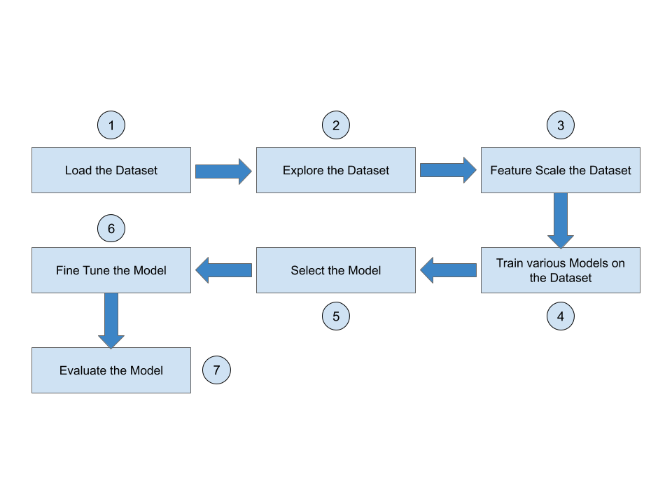

# Fashion MNIST - Description
##### Objective

Fashion-MNIST is a dataset of Zalando's article images —consisting of a training set of 60,000 examples and a test set of 10,000 examples. Each example is a 28x28 grayscale image, associated with a label.

The objective of the project is - to use Fashion-MNIST data set to identify (predict) different fashion products(articles) from the given images using Machine Learning.

##### We will be following the below steps to solve this problem:

1. Importing the libraries

2. Using some pre-defined utility functions

3. Loading the data

4. Cleaning the data

5. Dividing the dataset into training and test dataset using train_test_split in the ratio 85:15

6. Training several models and analyzing their performance to select a model

7. Use dimensionality reduction to improve the ‘training’,
‘fine-tuning’ and ‘prediction’ time.

8. Fine-tuning the model by finding the best hyper-parameters and features

9. Evaluating selected model using test dataset
## Load the Dataset

## Importing Libraries
To start with the code, we would need some libraries.

Please import the same into the environment, as per instructions mentioned below in Instructions box.

## Defining Functions
Let us define some functions which will be used in this course.

The showImage() function given below displays the input dataset instance (image) on the screen.

Loading the data
Let us load the Fashion MNIST dataset from Cloudxlab's below mentioned folder location (this dataset is copied from Zalando Research repository).

Location - '/cxldata/datasets/project/fashion-mnist/'

You need to load the below 4 dataset files:

train-images-idx3-ubyte.gz - this contains the Training dataset
train-labels-idx1-ubyte.gz - this contains the Training labels (target dataset)
t10k-images-idx3-ubyte.gz - this contains the Test dataset
t10k-labels-idx1-ubyte.gz - this contains the Test labels
The class labels for Fashion MNIST are:

  Label    Description

    0         T-shirt/top
    1         Trouser 
    2         Pullover 
    3         Dress
    4         Coat
    5         Sandal 
    6         Shirt
    7         Sneaker
    8         Bag
    9         Ankle boot
Out datasets consists of 60,000 images and each image has 784 features. An image consists of 28x28 pixels, and each pixel is a value from 0 to 255 describing the pixel intensity. 0 for white and 255 for black.

## Fashion MNIST - Understanding the data
Our training dataset consists of 60,000 images and each image has 784 features. An image consists of 28x28 pixels, and each pixel is a value from 0 to 255 describing the pixel intensity. 0 for white and 255 for black.

Let us have a look at one instance (an article image) of this training dataset X_train.

To view a single instance(an article image),all we need to do is grab an instance’s feature vector, reshape it to a 28×28 array, and display it using Matplotlib’s imshow() function.

Compare the digit in the image to its corresponding actual digit in the target dataset.

## Fashion MNIST - Data Preparation
Now, let us prepare data for training the model.

As part of data preparation, we need to perform following techniques on the data:

1. Shuffling

2. Feature Scaling

Shuffling the training dataset - to get uniform samples for cross validation

We need to shuffle our training data to ensure that we don't miss out any article (fashion product) in a cross validation fold.

Feature Scaling

Each image (instance) in the dataset has 784 pixels (features) and value of each feature(pixel) ranges from 0 to 255, and this range is too wide , hence we would need to use feature scaling here to apply standardization to this dataset X_train, so that all the values of each feature (pixel) is in a small range (based on the standard deviation value).

x_scaled = (x - x_mean) / standard deviation
Scaling is not needed for Decision Tree and Random Forest algorithms

## Fashion MNIST - Training the Model
As the data preparation is over, let us now train a few Machine Learning(ML) models.

We will be training the following ML models:

Softmax Regression (multi-class LogisticRegression)

RandomForestClassifier

Ensemble (with soft voting)

## Fashion MNIST - Training the Model - Softmax Regression
Let us now train the Softmax Regression (Logistic Regression - multi_class-multinomial). We will be doing the following as part of this exercise:

1. We will be first training the Softmax Regression (Logistic Regression - multi_class-multinomial) on the training dataset
2. Using the trained model, make the prediction on a sample instance and compare the prediction with the actual value.
3. Using the trained model, make the prediction on the whole training dataset
4. Calculate - accuracy, precision, recall and F1 Score for Softmax Regression (Logistic Regression - multi_class-multinomial).

## Fashion MNIST Training the Model - RandomForestClassifier
Let us now train the RandomForestClassifier. We will be doing the following as part of this exercise:

1. We will be first training the RandomForestClassifier on the training dataset
2. Using the trained model, make the prediction on a sample instance and compare the prediction with the actual value.
3. Using the trained model, make the prediction on the whole training dataset
4. Calculate - accuracy, precision, recall and F1 Score for RandomForestClassifier.

## Fashion MNIST - Selecting the Model - Cross-Validation
Now, let us use cross validation to find the proper score of each model, also to ensure that the model is not overfitting or underfitting. Based on this cross-validation, we will select the model for fine-tuning its hyperparameters.

#### NOTE:

If the cross validation score values for a performance measure (say accuracy) are not varying significantly for various folds (k-folds), then we can say that the model is not overfitting.
If the cross validation score values for a performance measure (say accuracy) are not very low for various folds (k-folds), then we can say that the model is not underfitting.
We will perform k-fold cross-validation. We will randomly split the training set into 3 distinct subsets called folds (cv=3). Since cross validation is a computing intensive and time consuming process, we are limiting 'cv' (no. of folds) to 3 instead of normally 10 folds. Then will train and evaluate each model 3 times by picking a different fold for evaluation every time and training on the other 2 folds The result will be an array containing the 3 evaluation scores for each of the measures - accuracy, precision, recall, F1 score. We will use cross_val_score() function to calculate accuracy

But accuracy is generally not the preferred performance measure for classifiers, especially when you are dealing with skewed datasets. (A dataset is said to be skewed when some classes are much more frequent than others. )

Even if the current training dataset may not be skewed, the future test dataset (live) on which the model runs can be skewed, hence, considering we may get skewed dataset in future, let us calculate Precision, Recall and F1 score also for the models. And will use cross_val_predict() function to create confusion matrix to calculate Precision, Recall and F1 score.

## Fashion MNIST - Selecting the Model - Cross-Validation - Softmax Regression
Let us import some libraries and define a function (display_scores()) which we will be using for cross-validation.

We will be performing k-fold cross-validation with 3 folds (cv=3) on the Softmax Regression model, and calculating the mean accuracy, precision, recall and F1 score values for the same.

## Fashion MNIST - Selecting the Model - Cross-Validation - RandomForestClassifier
We will be performing k-fold cross-validation with 3 folds (cv=3) on the RandomForestClassifier model, and calculating the mean accuracy, precision, recall and F1 score values for the same.

## Fashion MNIST - Fine-Tuning the Model - Grid Search - Dimensionality Reduction
We will perform using 'Grid Search' technique.

Grid search takes a lot of time on large datasets. Hence, let us apply 'Dimensionality Reduction' to the training dataset to reduce the number of features in the dataset, so that the time taken for grid search and prediction is reduced. Also, we will calculate the scores based on the reduced features.

We will also check, if dimensionality reduction leads to any significant loss of information from the images in our training dataset. If we get a significant loss of information with dimensionality reduction, we will not use dimensionality reduction for our training dataset (and hence the problem).

Our dataset is not like a Swiss-roll, therefore, we don't need to convert a 3-dimensional dataset to 2-dimensional plane, etc. Hence, we won't be using Manifold technique for dimensionality reduction here.

We will be using Projection technique (PCA) for dimensionality reduction for our problem.

We will use Scikit Learn's PCA class which uses SVD (Singular Value Decomposition) internally and also the projection.

You can experiment with various values of n_components (variance ratio).

For the current problem, with n_components=0.95, in the reduced dataset (X_train_reduced) we got only 187 features (out of original 784), and there was significant loss of information (quality) in the 'recovered' (decompressed) images. Hence, we have selected n_components=0.99, which gives 459 features (out of original 784) and there is no significant loss of information (quality) in the 'recovered' images.

The comparison of the 'original' dataset images and the 'compressed' dataset images (got after decompression) shows that there is not much information loss due to dimensionality reduction by using 0.99 variance ratio. Hence, we will go ahead with performing the Grid Search using this 'reduced' training dataset (X_train_reduced).

## Fashion MNIST - Fine-Tuning the Model - Grid Search - Tuning Hyperparameters
Let us now perform the Grid Search using the dimensionally reduced training dataset X_train_reduced.

Since our best model is Voting Classifier which is made up of two models Logistic Regression and Random Forrest. To do the grid search, we will have to supply the various values of parameters for both of the underlying models.

Since the grid search is a very intensive process, we are going to only try a handful of permutations because it would take a huge time otherwise.

## NOTE:

In real-time scenarios, you might also like to train XGBoost and most likely, XGBoost would be the winning model. So, in those cases, you will have to do the hyperparameter training of XGBoost.

## Fashion MNIST - Evaluating Final Model on Test Dataset
Since, we already got our 'final' model from grid search (best_estimator_), let us evaluate the same on the test dataset.

Since, we performed grid search on the dimensionally reduced training dataset X_train_reduced, we need to apply dimensionality reduction the the test dataset also before we could use it for prediction on the test dataset.
